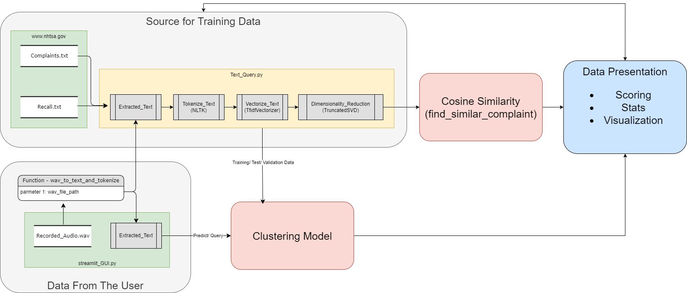

# SIADs_Audio_Text_SRS
This is a high level flow diagam showing the data flow for the project.


## Step 1: Create a Virtual Enviroment
created in a Python 3.10.11 instance virtual enviroment
```
PS C:\Repo\SIADs_Audio_Text_SRS> python3 -m pip install virtualenv
PS C:\Repo\SIADs_Audio_Text_SRS> python3 -m venv env
```
Once the venv is created active the venv
```
PS C:\Repo\SIADs_Audio_Text_SRS> .\env\Scripts\activate
```
When running the virtual enviroment you should see (env). The next step is to pip install the requirements file
```
(env) PS C:\Repo\SIADs_Audio_Text_SRS> pip install -r requirements.txt
```
Deactivate the virtual environment by issuing the “deactivate” 
```
(env) PS C:\Repo\SIADs_Audio_Text_SRS> deactivate  
PS C:\Repo\SIADs_Audio_Text_SRS> 
```
When adding pip installs into the virtual enviroment the below command will update the requirements for other users.
```
python -m pip freeze > requirements.txt
```
## Step 2: Running the Streamlit
Run the below command in a power shell terminal to launch the streamlit application.
```
(env) PS C:\Repo\SIADs_Audio_Text_SRS> python -m streamlit run 'C:\Repo\SIADs_Audio_Text_SRS\Example\streamlit_GUI.py'
```
To stop the python streamlit app
```
^C
^C
```